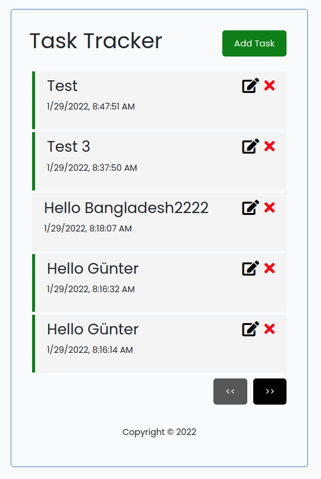
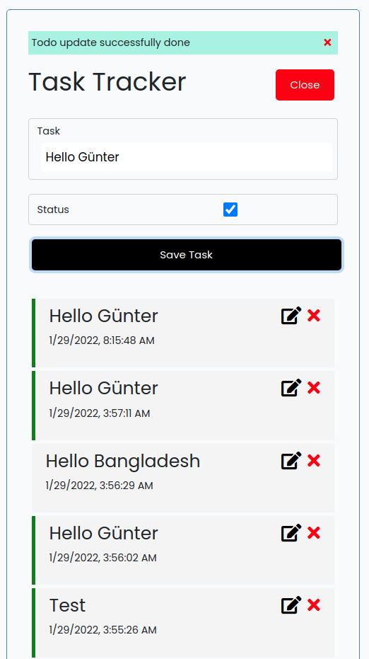

# Laravel, Vue.js, and Vuex TodoList Web Application

This is a Web Application leveraging on Vue.js, vuex and Laravel to create SPA(Single Page Application) application.

The following must be installed and available on your terminal:
- [x] [composer](https://getcomposer.org/doc/00-intro.md)
- [x] [npm](https://nodejs.org/en/)

### Screenshots




### INSTALLATION GUIDE
- Clone the project
   `git clone https://github.com/ranasl62/todo-laravel-vuejs.git`
- ``cd`` to the project and run ``composer install`` on the terminal to install php dependencies
- copy the `.env-example` file to `.env` file
- Create a Mysql database and edit the ``.env`` to reflect your connections as follows:
    ```dotenv
    DB_CONNECTION=mysql
    DB_HOST=127.0.0.1
    DB_PORT=3306
    DB_DATABASE=dbname
    DB_USERNAME=myuser
    DB_PASSWORD=mypass
    ```
- Migrate your migrations: `php artisan migrate`
- Generate application encryption key: `php artisan key:generate`
- Run `npm install && npm run dev` to install node.js dependencies and build the vuejs codes
- Start your development server using laravel [command](https://laravel.com/docs/8.x/artisan) `php artisan serve --port 8000`
- Visit on browser `localhost:8000`
- Congratulations if you made it!

Need helps? Reach me out
>Email: ranasl62@gmail.com
>
>Twitter: [ranasl62](https://twitter.com/ranasl62)
>
>Linkedin: [ranasl62](https://www.linkedin.com/in/ranasl62/)
>
>Facebook: [ranasl62](https://www.linkedin.com/in/ranasl62/)

All the best
